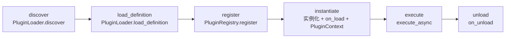

# 生命周期与上下文

插件从加载到执行的全生命周期，以及 `PluginContext` 提供的运行时能力。

## 生命周期



### 详细阶段

### 1. discover — 扫描

`PluginLoader` 扫描 `plugins/` 目录，找到所有包含 `.py` 文件的子目录：

```
plugins/
├── weather/__init__.py     → 发现
├── dice/__init__.py        → 发现
├── admin/main.py           → 发现
└── disabled/readme.txt     → 跳过（无 .py 文件）
```

### 2. load_definition — 加载

对每个发现的插件：

1. **安装依赖**：AST 解析 `_plugin_dependencies` 列表（不执行代码）
2. **导入类**：`importlib` 导入模块，查找 `PluginBase` 子类
3. **构建定义**：`PluginDefinition.from_class()` 提取 `@command` 元数据
4. **回退**：如果没有 `PluginBase` 子类，尝试读取 `plugin.json`

### 3. register — 注册

`PluginRegistry` 注册插件：

```
plugin_def.commands → _commands_index: [(pattern, type, plugin, cmd_meta)]
plugin_def.events   → _events_index: [PluginDefinition]
NL examples        → _nl_examples_index
```

### 4. instantiate — 实例化

首次执行时（或通过 `instantiate_all()`）：

```python
instance = plugin_class()                    # 创建实例
context = PluginContext.create(              # 构建上下文
    engine=engine_proxy,
    adapter=adapter,
    plugin_name=name,
    message=message_context,
    data_store=PluginDataStore(...),
    config=config,
)
instance._setup(name, context)               # 注入上下文
instance._set_source_path(path)              # 记录源码路径
instance.on_load()                           # 触发加载回调
```

### 5. execute — 执行

```python
PluginExecutor.execute(
    plugin_name="weather",
    cmd=CommandAST(...),
    group_id="123456",
    user_id="789",
)

# 内部流程:
→ _check_permissions(def, ...)     # 权限校验
→ _check_rate_limit(name, def)       # 速率限制
→ registry.get_instance(name) or instantiate()
→ instance.execute_async(cmd)        # 执行（优先异步方式）
→ list[PluginResponse]
```

### 6. unload — 卸载

```python
instance.on_unload()                    # 清理回调
registry.unregister(name)               # 注销
```

## PluginContext — 运行时环境

`self.ctx` 提供插件所需的全部运行时能力。

### 属性一览

| 属性 | 类型 | 说明 |
|------|------|------|
| `ctx.engine` | `EngineProxy` | 引擎能力代理 |
| `ctx.adapter` | `BaseAdapter` | 平台适配器 |
| `ctx.message` | `MessageContext` | 当前消息上下文 |
| `ctx.data_store` | `PluginDataStore` | 插件专属 KV 存储 |
| `ctx.config` | `PluginConfig` | 插件配置 |
| `ctx.plugin_name` | `str` | 插件名称 |
| `ctx.logger` | `Logger` | 插件专属 logger |

### MessageContext

```python
@dataclass
class MessageContext:
    group_id: str       # 群聊 ID
    user_id: str        # 发送者 ID
    channel: str        # 频道类型（group/private）
    channel_user_id: str # 频道内用户 ID
    message_id: str     # 消息 ID
    content: str        # 原始消息内容
    speaker_name: str   # 发送者称呼
```

## EngineProxy — 引擎能力

通过 `ctx.engine` 调用引擎的 LLM 能力和其他功能：

### LLM 调用

```python
# 走完整框架生成链路
response = ctx.engine.generate_text(
    prompt="请总结以下对话",
    group_id=ctx.message.group_id,
)

# 使用分析小模型（更快、更便宜）
analysis = ctx.engine.generate_text_analysis(
    prompt="判断这条消息的情绪是正面还是负面",
    group_id=ctx.message.group_id,
)

# 绕过引擎管线，直接调用 provider
result = ctx.engine.generate_raw(
    prompt="总结内容",
    system_prompt="你是专业编辑",
    messages=[],
    temperature=0.3,
    max_tokens=200,
)
```

### 信息获取

```python
# 获取当前人格信息
persona_name = ctx.engine.get_persona_name()
persona_info = ctx.engine.get_persona_info()

# 获取原始引擎引用（高级用法）
raw_engine = ctx.engine.get_engine()
```

### 事件发射

```python
# 发射自定义事件
ctx.engine.emit_event("my_custom_event", {"data": "..."})
```

## PluginDataStore — 数据持久化

每个插件独立的 JSON 文件存储，自动管理读写：

```python
# 读取
count = ctx.data_store.get("usage_count", 0)

# 写入（自动持久化）
ctx.data_store.set("usage_count", count + 1)
ctx.data_store.set("last_user", ctx.message.user_id)

# 删除
ctx.data_store.delete("temp_key")

# 获取全部
all_data = ctx.data_store.all()
```

数据文件路径：`data/personas/{name}/skill_data/plugin_{plugin_name}.json`

## on_load / on_unload 回调

### 初始化（on_load）

```python
class MyPlugin(PluginBase):
    def on_load(self):
        """插件加载时执行一次"""
        count = self.ctx.data_store.get("load_count", 0)
        self.ctx.data_store.set("load_count", count + 1)
        self.ctx.logger.info("插件已加载，这是第 %d 次", count + 1)
```

### 清理（on_unload）

```python
class MyPlugin(PluginBase):
    def on_unload(self):
        """插件卸载时执行一次"""
        self.ctx.data_store.set("last_unload", 
            __import__("datetime").datetime.now().isoformat())
        self.ctx.logger.info("插件正在卸载，清理资源...")
```

## 权限与速率控制

### PluginPermissionDef 字段

```python
@command(
    name="admin_cmd",
    # 权限控制
    ...
)
```

在 `plugin.json` 中配置：

```json
{
  "permissions": {
    "developer_only": true,
    "hidden_from_intent": true,
    "group_blacklist": ["123456"],
    "rate_limit_calls_per_minute": 5,
    "_per_hour": 50
  }
}
```

权限校验在 `PluginExecutor.execute()` 中自动执行。

## 模板渲染

插件可以使用 `templates/` 目录下的模板文件：

```python
# templates/weather.md
"""
## {city} 天气
- 温度：{temp}°C
- 湿度：{humidity}%
- {condition}
"""

# 渲染
text = self.render_template("weather.md", {
    "city": "北京",
    "temp": 25,
    "humidity": 60,
    "condition": "晴",
})
```

## 进程模型

插件运行在引擎主进程中（与 engine 共享 event loop），所以：

- ✅ 可以使用 `async/await`
- ✅ 可以访问引擎的所有能力
- ⚠️ 不要执行耗时同步操作（阻塞 event loop）
- ⚠️ 使用 `asyncio.to_thread` 包裹同步操作

```python
import asyncio

@command(name="heavy")
async def heavy_op(self) -> PluginResponse:
    # 正确：耗时操作放到线程池
    result = await asyncio.to_thread(heavy_sync_function)
    return PluginResponse.ok(text=result)
```

## 下一步

- [指令系统详解](./plugin-command) — 完整解析链路
- [编写自定义插件](./plugin-authoring) — 从零创建插件
