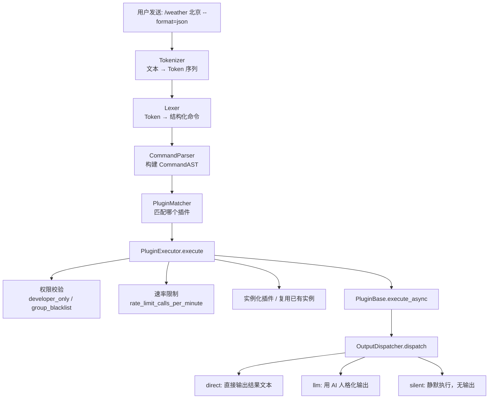
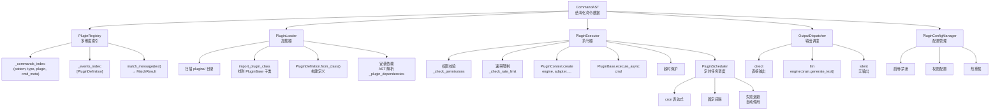

# 插件系统总览

插件（Plugin）是面向用户命令行的扩展机制。用户可以输入 `/` `#` `!` 等前缀命令，由插件响应。

## 工作原理



## 关键概念

### 指令前缀

默认支持三种前缀：

| 前缀 | 示例 |
|------|------|
| `/` | `/weather 北京` |
| `#` | `#骰子 6` |
| `!` | `!roll 2d6` |

### 渲染模式（RenderMode）

插件执行后的输出有三种展示方式：

| 模式 | 说明 | 适用场景 |
|------|------|------|
| `direct` | 直接输出原始文本，不做修改 | 格式化数据、查询结果 |
| `llm` | 结果传给 AI 做人格化润色 | 需要自然语言表达 |
| `silent` | 静默执行，不在聊天中显示 | 后台操作、副作用 |

### 参数匹配模式（PatternType）

| 模式 | 说明 | 示例 |
|------|------|------|
| `prefix` | 前缀精确匹配，支持多词命令（如 `/ca analyse` 整体作为命令） | `/weather` 匹配 `/weather` |
| `keyword` | 关键词包含匹配 | `/天气` 中 "天气" 匹配 `/北京天气` |
| `regex` | 正则表达式匹配 | `/roll\s+\d+d\d+` 匹配 `/roll 2d6` |

### @command 装饰器

替代传统 `execute()` 方法的新范式：

```python
from sirius_pulse.plugins import PluginBase, command

class MyPlugin(PluginBase):
    @command(
        name="weather",
        prefix="/",
        patterns=["/weather"],
        description="查询天气",
        render_mode="llm",
    )
    async def handle_weather(self, city: str, format: str = "text"):
        # 自动从 CommandAST 提取 city 和 format
        ...
```

> **多词命令**：prefix 模式的 pattern 可以包含空格（如 `/ca analyse`），系统会自动将匹配到的后续位置参数归入命令名，实现多词命令。

### 定时事件 (PluginScheduler)

插件可以注册定时触发的事件，通过 `_plugin_events` 属性定义 cron 表达式或固定间隔。系统启动时，PluginScheduler 会根据这些定义创建定时任务，在到期时调用插件的 `on_event()` 方法。支持失败退避和自动停用机制。

| 字段 | 说明 | 示例 |
|------|------|------|
| `cron` | cron 表达式 | `"0 * * * *"` 每小时整点 |
| `interval_seconds` | 固定间隔秒数 | `300` 每5分钟 |
| `description` | 事件描述 | `"定时天气更新"` |

```python
from sirius_pulse.plugins import PluginBase, PluginEvent, PluginEventType

class TimerPlugin(PluginBase):
    _plugin_events = [
        PluginEvent(
            type=PluginEventType.SCHEDULE,
            cron=None,
            interval_seconds=60,
            description="每分钟执行一次"
        )
    ]

    async def on_event(self, event_type: str, event_data: dict):
        print(f"事件触发: {event_type}, 数据: {event_data}")
```

## 系统架构



## 与技能的对比

| | 插件 | 技能 |
|---|---|---|
| **调用者** | 用户显式命令 | AI 自主决定 |
| **语法** | `/command args` | `[SKILL_CALL: ...]` |
| **触发方式** | 文本模式匹配 | LLM 意图驱动 |
| **开发范式** | 继承 PluginBase + @command | 函数 + SKILL_META |
| **输出** | direct / llm / silent | 注入 LLM 上下文 |
| **权限** | 细粒度（群黑名单、速率限制） | developer_only 标记 |
| **适用** | 固定功能、快速命令 | AI 辅助工具调用 |

## 下一步

- [编写自定义插件](./plugin-authoring) — 从零创建一个插件
- [指令系统详解](./plugin-command) — Tokenizer → Lexer → Parser 完整链路
- [生命周期与上下文](./plugin-lifecycle) — PluginContext、EngineProxy、数据持久化
