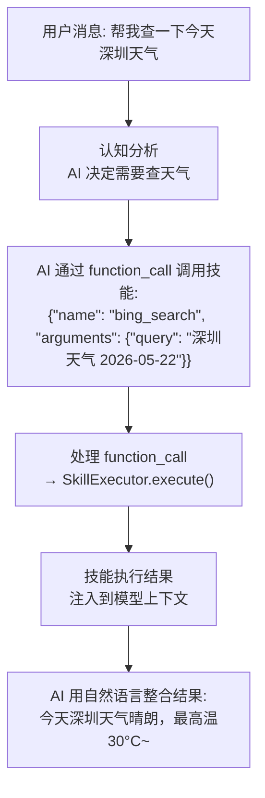
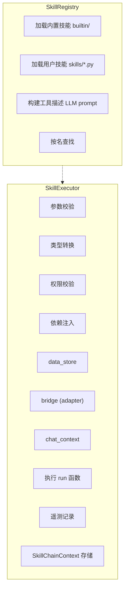
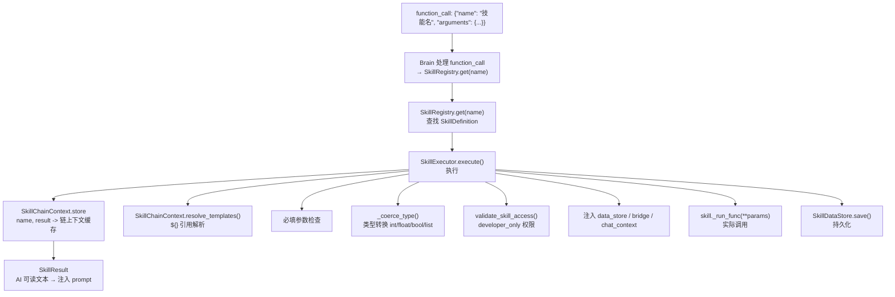

# 技能系统总览

技能（Skill）是 Sirius Pulse 最核心的扩展机制。AI 模型可以在对话中**自主决定**何时调用技能来获取信息或执行操作。

## 工作原理



## 关键概念

### function_call 机制

技能调用通过 OpenAI 风格的 function_call (tools) 机制实现，AI 模型在 tools 参数中声明可用技能，需要在回复中返回函数调用对象。

格式为：

```json
{"name": "技能名称", "arguments": {"参数名": "参数值"}}
```

引擎自动处理 function_call 并执行技能。

### 技能链（Skill Chain）

同一轮对话中可以调用多个技能，后一个技能可以引用前一个技能的结果：

```json
{"name": "file_list", "arguments": {"path": "docs"}}
{"name": "file_read", "arguments": {"path": "${file_list.results[0].name}"}}
```

`${skill_name.field}` 语法可在参数中引用之前技能的结果。

### 技能分类

| 类型 | 描述 | 示例 |
|------|------|------|
| **普通技能** | 被 AI 主动调用，有 `run` 函数 | `bing_search`、`file_read` |
| **被动技能** | 自动运行，无需 AI 调用 | `reminder`（后台检查）、`github_monitor`（轮询） |
| **混合技能** | 既可以被调用，也有后台任务 | `reminder` |
| **适配器绑定技能** | 需要特定平台 adapter | `send_image`（NapCat） |

> **被动技能类型**：被动技能可细分为**周期型**（periodic，后台定时任务）、**触发型**（trigger，事件驱动）和**兼有型**（both，既定时又触发），通过 `passive_type` 属性区分。

每个技能还可以通过 `model_visible` 属性控制是否对 AI 可见。默认为 `true`，设为 `false` 时，该技能不会出现在 AI 的 tools 列表中，AI 也无法主动调用它。例如，`list_pinned_messages` 技能已设置为 `model_visible=false`，因为钉住的重要消息会自动注入到对话上下文中，不需要 AI 再通过工具查询。

### 技能链（Skill Chain）

同一轮对话中可以调用多个技能，后一个技能可以引用前一个技能的结果：

```json
{"name": "file_list", "arguments": {"path": "docs"}}
{"name": "file_read", "arguments": {"path": "${file_list.results[0].name}"}}
```

`${skill_name.field}` 语法可在参数中引用之前技能的结果。

## 系统架构



## 数据流



## 内置技能一览

| 技能 | 功能 | 类型 |
|------|------|------|
| `bing_search` | 必应网页搜索 | 普通 |
| `url_content_reader` | 网页内容提取 | 普通 |
| `desktop_screenshot` | 桌面截图（dev only） | 普通 |
| `system_info` | 系统信息查询 | 普通 |
| `reminder` | 定时提醒（创建/列表/取消） | 混合 |
| `github_monitor` | GitHub 仓库事件监控 | 被动 |
| `learn_term` | 学习新术语 | 普通（silent） |
| `file_read` | 读取工作区文件 | 普通 |
| `file_write` | 写入工作区文件 | 普通 |
| `file_list` | 列出工作区文件 | 普通 |
| `send_image` | 发送图片到对话 | 适配器绑定 |
| `upload_file` | 上传文件到对话 | 适配器绑定 |
| `send_workspace_file` | 发送工作区文件 | 适配器绑定 |

> 注意：部分技能可能因 `model_visible=false` 而不在列表中展示给 AI，例如 `list_pinned_messages` 已被隐藏，因为钉住消息已自动注入上下文。

## 与插件的对比

| | 技能 | 插件 |
|---|---|---|
| **调用者** | AI 决定何时调用 | 用户显式命令 |
| **语法** | function_call (tools) | `/command args` |
| **输出** | 反馈给 AI 做自然语言整合 | 直接/LLM 人格化/静默 |
| **开发** | 写一个 `run` 函数 | 继承 `PluginBase` |
| **适用** | AI 需要工具完成任务 | 用户需要固定功能命令 |

## 下一步

- [编写自定义技能](./skill-authoring) — 从零创建一个技能
- [内置技能参考](./skill-builtin) — 所有内置技能的详细文档
- [被动技能开发](./skill-passive) — 后台任务和事件驱动技能
