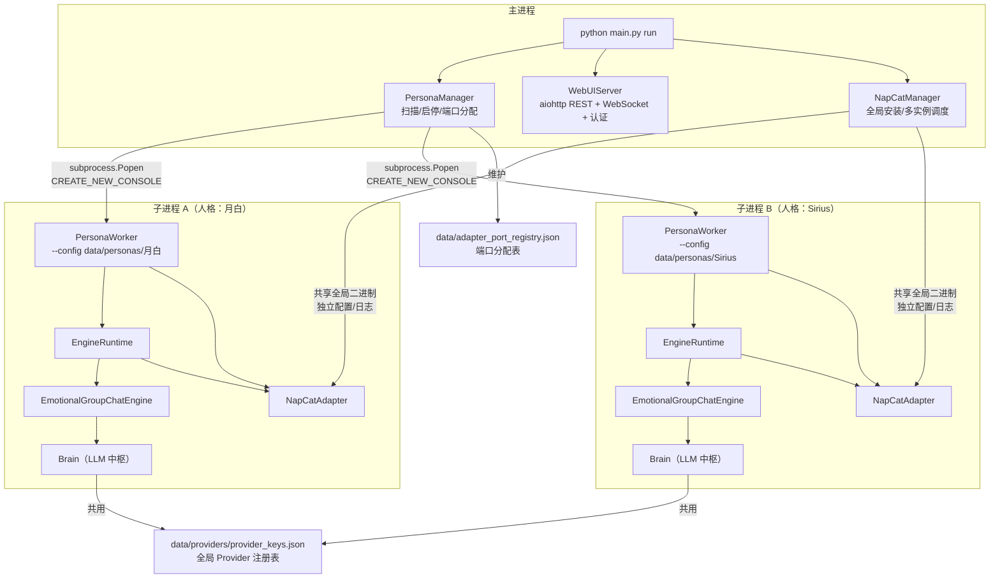
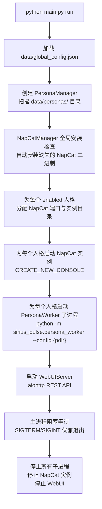
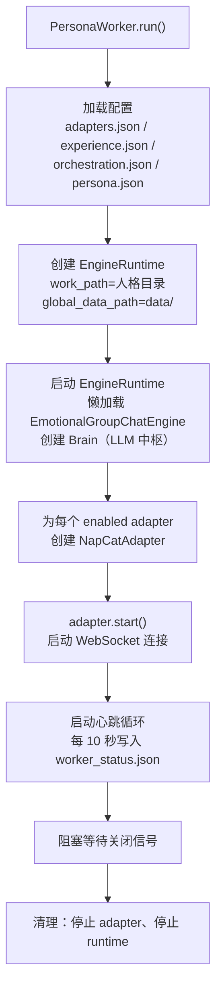
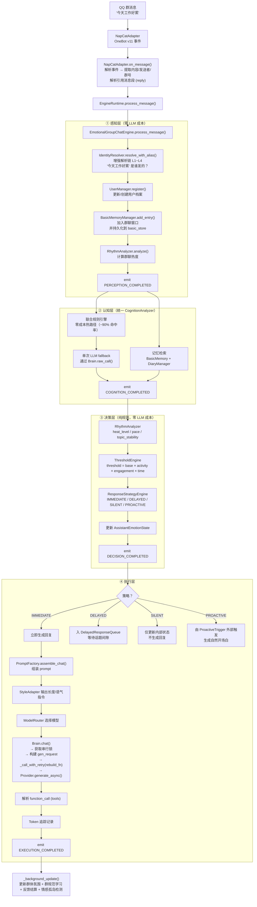
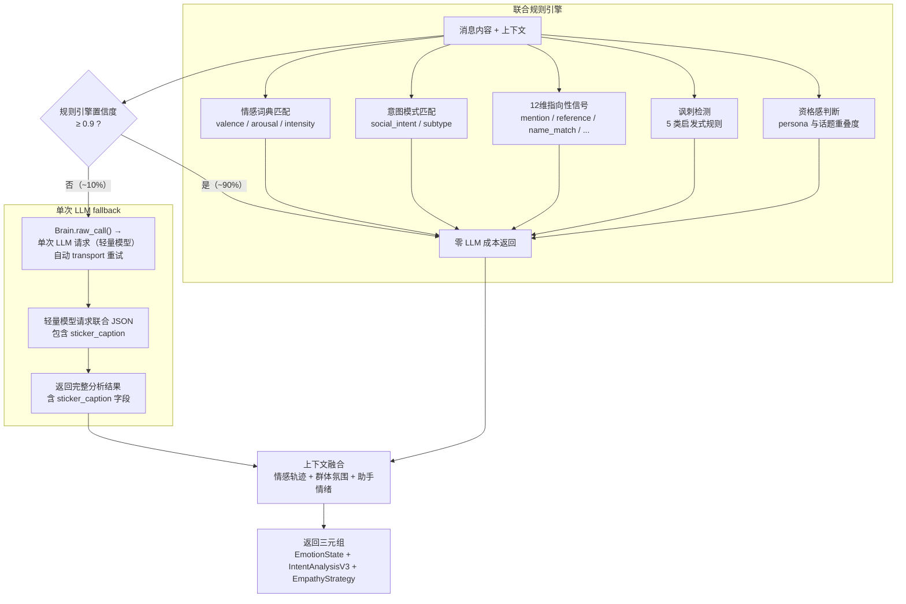
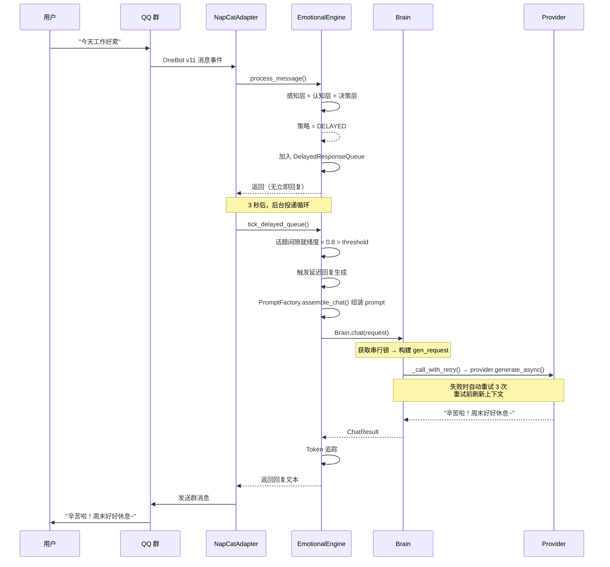
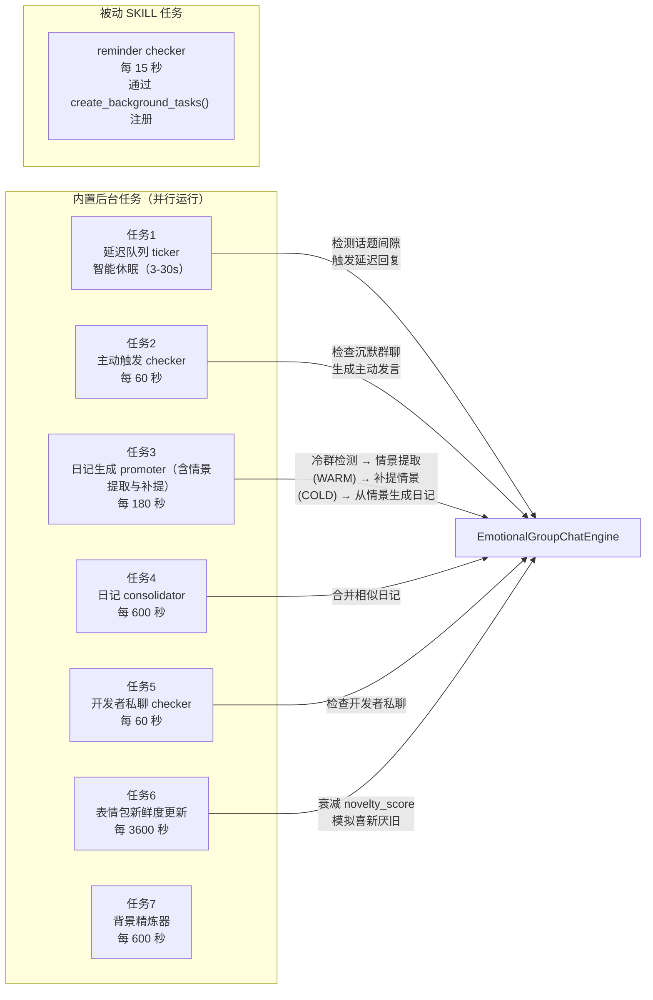

# 系统架构全景

> **v1.2 多人格架构的真实执行路径与模块边界**
>
> 本文档用人类易读的方式，从"一条消息怎么被处理"到"整个系统怎么运转"，完整描述 Sirius Pulse 的架构。流程图使用 Mermaid 语法。

---

## 第一章：系统全景图

### 1.1 你在看什么

Sirius Pulse 是一个**支持多人格启用的异步角色扮演程序**。想象一个 QQ 群里同时有几个不同的 AI 角色在聊天——有的活泼、有的高冷、有的毒舌——每个人格独立运行、独立记忆、独立配置。

### 1.2 进程模型



### 1.3 关键设计决策

| 决策 | 说明 |
|------|------|
| **独立子进程** | 每个人格一个独立进程，崩溃不影响其他人格 |
| **数据隔离** | 每个人格有自己的目录 `data/personas/{name}/`，记忆、配置、日志完全隔离 |
| **Brain 统一调用** | 所有人格共用 `provider_keys.json`，但各自有独立的 Brain 实例，LLM 调用总是通过 Brain 完成，不再散落各处 |
| **chat 串行，raw 并行** | `chat()` 通道串行化保证消息顺序；`raw_call()` 通道不受限，可与 chat 并行 |
| **NapCat 多实例** | 每个人格独立的 QQ 实例，共享全局二进制，独立配置和日志 |
| **端口自动分配** | `PersonaManager` 从 3001 开始递增分配 WebSocket 端口 |
| **内存+持久化双写** | 每次记忆写入 `basic_memory`（内存窗口）后自动同步到 `basic_store`（持久化存储），确保重启后上下文不丢失 |

---

## 第二章：主进程启动流程

### 2.1 从命令行到运行

```bash
python main.py run
```



### 2.2 主进程三大组件

**PersonaManager（人格管家）**
- `create_persona(name)` — 创建新人格目录和默认配置
- `start_persona(name)` — 启动单个人格（含 NapCat 自动管理）
- `run_all()` — 批量启动所有 enabled 人格
- `get_logs(name)` — 读取子进程日志
- `get_status(name)` — 读取子进程心跳状态

**WebUIServer（管理面板）**
- 提供 REST API：人格列表、状态、配置、日志、监控
- 提供 WebSocket 事件推送：实时接收引擎事件
- 提供 JWT 认证：admin/viewer 角色权限控制
- 提供静态页面：Dashboard + 配置面板 + 监控页面
- 不直接操作 NapCat 进程，只通过 API 与 PersonaManager 交互
- 保存 Provider 配置后自动通知所有运行中的人格外进程热重载 provider 配置；WebUI 的存储相关 API 以只读模式打开数据库，避免与引擎写操作产生锁冲突
- 提供用户别名管理 API（添加、删除、shadow 标记），别名数据直接持久化在 `memory.db` 的 `aliases` 表，管理操作不再依赖演化链中间缓存。

**NapCatManager（QQ 管理器）**
- 管理 NapCat 全局二进制（安装、更新）
- 为每个人格创建独立实例目录
- 启动/停止 NapCat 进程

---

## 第三章：人格子进程启动流程

### 3.1 子进程内部发生了什么



### 3.2 子进程内的关键协作

- 所有 bridge 共享同一个 `EngineRuntime` 和同一个 Brain 实例
- 每个 bridge 有自己的 `allowed_group_ids` 配置
- engine 的 `_pending_reminders` 是共享的（所有 bridge 都能投递提醒）
- Brain 是单例的，`chat()` 串行执行，`raw_call()` 可与 chat 并行
- **Brain system prompt 变更**：v1.3 起，Brain 的默认 pre‑hook 不再自动拼接 `memory_spec` 部分。构建系统提示时，将由 `PromptFactory.assemble_chat()` 等上层调用负责组装客户化记忆相关指令。如需自定义记忆策略，请通过 `build_system_prompt()` 或在配置中调整。
- **IdentityResolver 增强解析**：`IdentityResolver` 新增 `resolve_with_alias()` 方法，支持四层解析链（精确平台ID→Bot自识别→别名精确→模糊匹配），返回值含置信度和来源，用于开发者判断和用户解析。
- 引擎支持配置文件热重载，通过写入 `engine_state/reload_requested` 标志文件触发，支持类型：`persona`、`orchestration`、`experience`、`provider`、`all`。其中 `provider` 类型会重新构建 Provider 实例，使 provider 配置变更无需重启引擎。

---

## 第四章：消息处理完整流程

### 4.1 一条消息的一生

假设群里有人发了一条消息："今天工作好累"，看看它怎么被处理。



> **新增持久化说明**：在 `BasicMemoryManager.add_entry()` 步骤中，消息不仅被加入内存窗口（最近 30 条），还会通过 `engine.basic_store.append()` 持久化到磁盘。这意味着即使引擎重启，基本记忆仍然可以恢复，对话上下文不会丢失。此持久化同样适用于 AI 回复记录和 SKILL 执行结果。
>
> **纯表情包回复的记忆记录**：当 AI 回复仅包含表情包时，引擎会识别两种格式：标准 `[STICKERS: 猫猫.jpg]` 或精确匹配已有表情包名称的 `[猫猫.jpg]` 格式（v1.3 起支持），并将其记录到基本记忆中（如 `[STICKERS: ...]`），支持最多 3 个表情包名称，确保纯表情包回复不会丢失。
>
> **动画表情缓存优化**：当用户发送一条纯动画表情消息时，引擎会首先检查该表情的缓存描述（caption）。如果缓存命中，则直接使用缓存的 caption 更新上一条最近消息（去除无意义的文件哈希），并立即返回 silent 策略，**跳过认知层**中的规则引擎和 LLM fallback，进一步降低 LLM 调用成本。此优化完全基于缓存，零 LLM 成本，从感知层之后直接短路到决策层。
>
> **标签记录（用户消息）**：在处理用户消息时，引擎会提取其中的多模态输入（图片、动画表情等）并生成对应的 `tags` 添加到基本记忆中。例如，动画表情产生 `{ "type": "sticker", "label": "动画表情 ×2" }`，普通图片产生 `{ "type": "image", "label": "图片 ×3" }`。这些标签可用于后续检索和统计。
>
> **标签记录（AI 回复）**：AI 回复中的表情包和钉住/取消钉住指令也会以 `tags` 形式记录，例如 `{ "type": "sticker", "label": "表情包: 猫猫.jpg, 狗狗.jpg" }` 或 `{ "type": "pin", "label": "钉住 ×1" }`。
>
> ~~**完整 LLM 消息链记录**：每次 AI 回复生成后（包括立即回复和延迟回复），引擎会将本次对话的完整 LLM 消息链（包含 system prompt 和所有用户/助手交替消息）作为 `conversation_chain` 字段保存到 `BasicMemoryEntry` 中。这为后续检索、调试和上下文重建提供了精确的输入记录，提升了记忆回溯的准确性。~~
>
> **v1.3 变更**：该功能已移除。自动记忆记录和回复时间戳追踪（`_last_reply_at`）不再通过 Brain post‑hooks 执行。延迟回复的记忆写入与去重逻辑已统一由 Brain post‑hooks 处理（见 `_hook_stickers`、`_hook_dedup`、`_hook_pin_messages` 等），因此不再单独保存完整 LLM 消息链。如需保留上下文记录，建议通过 `BasicMemoryManager.add_entry()` 手动写入。

> **插件命令快速拦截**：引擎新增插件命令拦截机制。在感知层完成消息记录后、认知层进行 LLM 或规则分析之前，引擎会检查消息内容是否匹配已注册的插件命令（如 `/ca analyse`）。若匹配，则直接执行插件逻辑并返回结果，避免了 LLM 对命令模式的错误理解。此步骤完全基于规则，零 LLM 成本，确保插件命令的及时响应。
>
> **引用消息解析**：NapCatAdapter 在解析消息段时，新增引用消息（reply 类型）的处理。当检测到回复段时，Adapter 会通过 NapCat API `get_msg` 获取被引用消息的内容和发送者信息，并将其格式化为 `[引用消息 msg_id="xxx" speaker="张三"] 内容 [/引用消息]` 注入到 prompt 中。这确保了 AI 在生成回复时能理解回复的上下文。此步骤完全基于规则，零 LLM 成本。
>
> **安全处理**：在标记消息时，引擎会对用户昵称和 ID 进行 HTML 转义（`html.escape`），防止 XSS 注入风险，确保输出到前端或日志时安全可靠。

### 4.2 认知层内部细节



### 4.3 延迟回复的触发



> **搜索内容优化**：延迟回复在构建上下文时，`search_query` 使用去除 XML 标签的原始聊天内容，避免标签干扰日记检索的准确性。
>
> **v1.3 Hook 统一处理**：延迟回复的最终回复处理（表情包解析、去重、记忆记录、时间戳更新）已全部移入 `Brain` 的 post‑hooks，不再由 `DelayedQueueTasks` 内部手动管理。因此 `delayed_response_queue` 中的 `sticker_names`、`clean_text` 等字段直接依赖 `ChatResult` 中 hook 处理后的结果。

### 4.4 四种响应策略的触发条件

| 策略 | 触发场景 | 行为 |
|------|---------|------|
| **IMMEDIATE** | 被 @、紧急求助、高 relevance | 立即生成并发送回复 |
| **DELAYED** | 一般性对话、话题间隙不够 | 加入队列，等自然间隙再回 |
| **SILENT** | 无关话题、低 relevance、冷却中 | 不回复，只后台学习 |
| **PROACTIVE** | 群聊沉默过久、记忆触发、情感触发 | 主动发起新话题 |

---

## 第五章：后台任务系统

### 5.1 引擎后台任务

引擎内置 7 个后台任务，另有被动 SKILL 注册的任务（如 reminder）并行运行：


