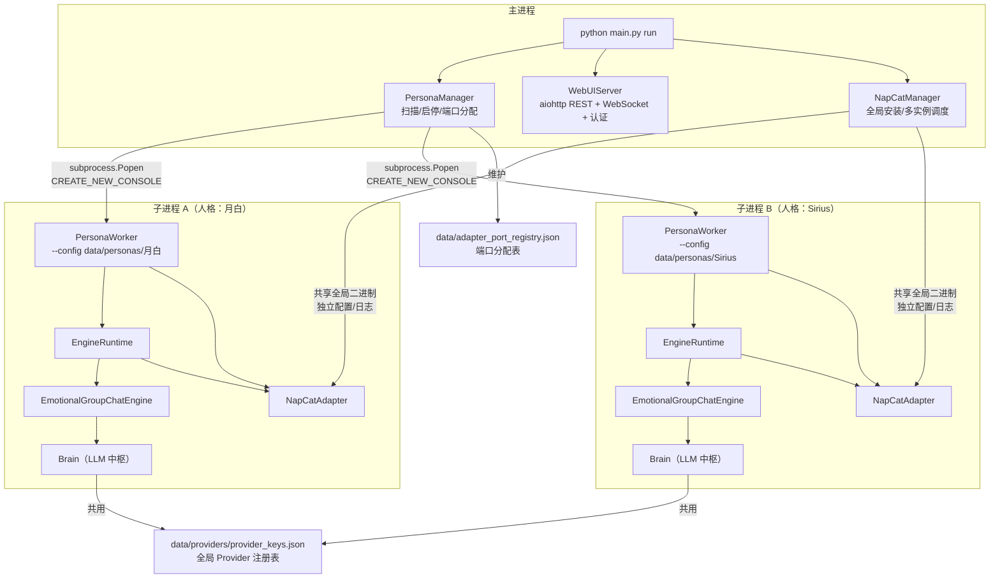
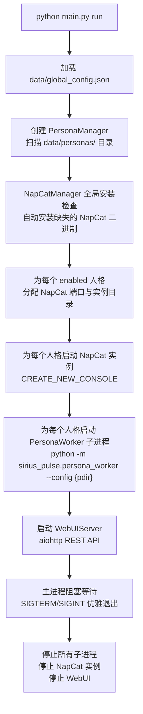
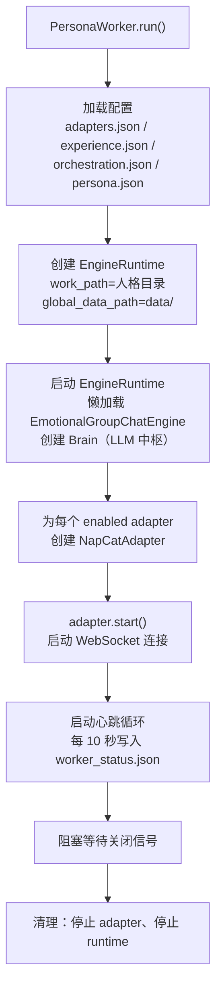
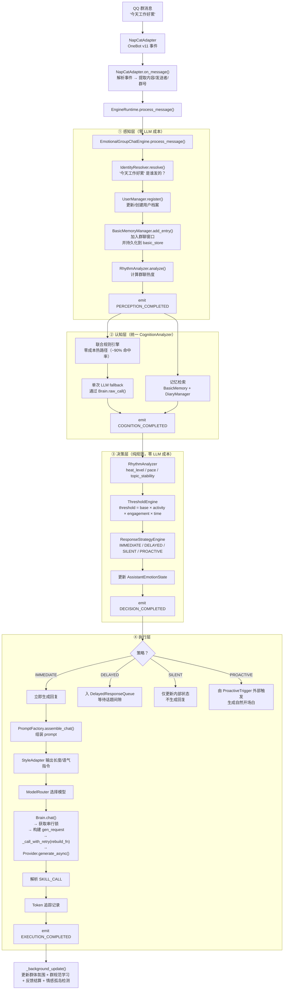
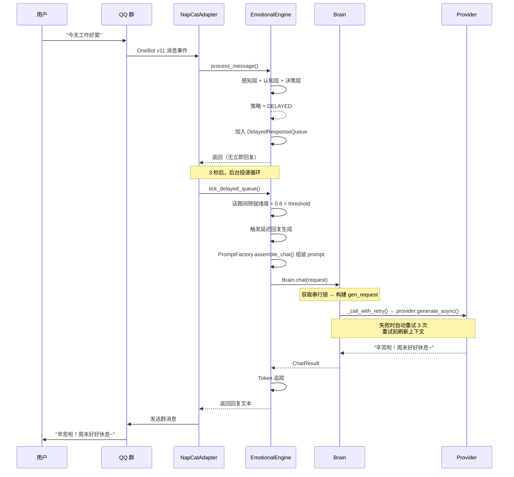
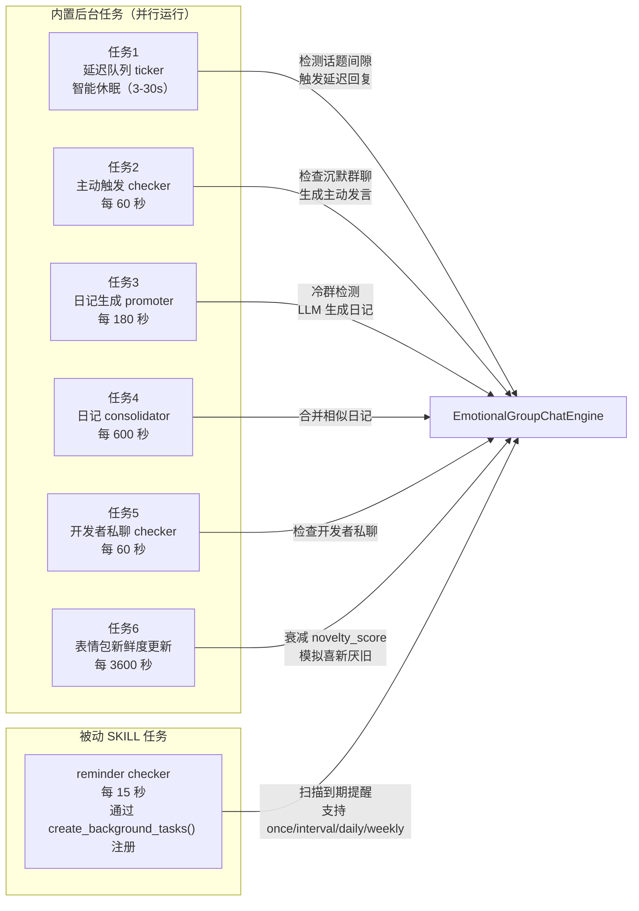
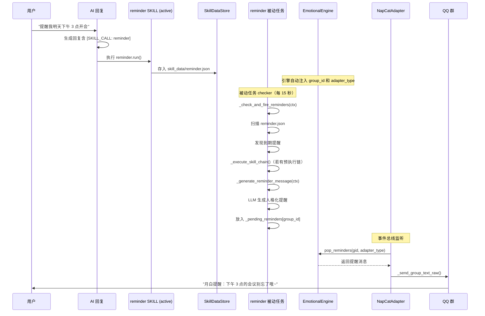
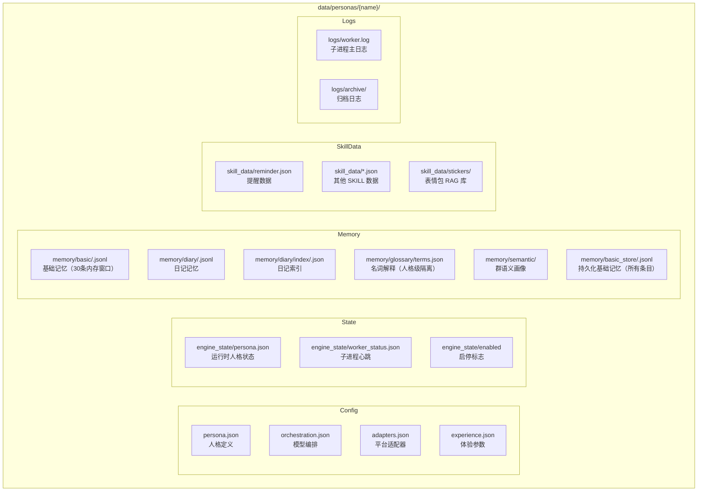

# 系统架构全景

> **v1.2 多人格架构的真实执行路径与模块边界**
>
> 本文档用人类易读的方式，从"一条消息怎么被处理"到"整个系统怎么运转"，完整描述 Sirius Pulse 的架构。流程图使用 Mermaid 语法。

---

## 第一章：系统全景图

### 1.1 你在看什么

Sirius Pulse 是一个**支持多人格启用的异步角色扮演程序**。想象一个 QQ 群里同时有几个不同的 AI 角色在聊天——有的活泼、有的高冷、有的毒舌——每个人格独立运行、独立记忆、独立配置。

### 1.2 进程模型



### 1.3 关键设计决策

| 决策 | 说明 |
|------|------|
| **独立子进程** | 每个人格一个独立进程，崩溃不影响其他人格 |
| **数据隔离** | 每个人格有自己的目录 `data/personas/{name}/`，记忆、配置、日志完全隔离 |
| **Brain 统一调用** | 所有人格共用 `provider_keys.json`，但各自有独立的 Brain 实例，LLM 调用总是通过 Brain 完成，不再散落各处 |
| **chat 串行，raw 并行** | `chat()` 通道串行化保证消息顺序；`raw_call()` 通道不受限，可与 chat 并行 |
| **NapCat 多实例** | 每个人格独立的 QQ 实例，共享全局二进制，独立配置和日志 |
| **端口自动分配** | `PersonaManager` 从 3001 开始递增分配 WebSocket 端口 |
| **内存+持久化双写** | 每次记忆写入 `basic_memory`（内存窗口）后自动同步到 `basic_store`（持久化存储），确保重启后上下文不丢失 |

---

## 第二章：主进程启动流程

### 2.1 从命令行到运行

```bash
python main.py run
```



### 2.2 主进程三大组件

**PersonaManager（人格管家）**
- `create_persona(name)` — 创建新人格目录和默认配置
- `start_persona(name)` — 启动单个人格（含 NapCat 自动管理）
- `run_all()` — 批量启动所有 enabled 人格
- `get_logs(name)` — 读取子进程日志
- `get_status(name)` — 读取子进程心跳状态

**WebUIServer（管理面板）**
- 提供 REST API：人格列表、状态、配置、日志、监控
- 提供 WebSocket 事件推送：实时接收引擎事件
- 提供 JWT 认证：admin/viewer 角色权限控制
- 提供静态页面：Dashboard + 配置面板 + 监控页面
- 不直接操作 NapCat 进程，只通过 API 与 PersonaManager 交互

**NapCatManager（QQ 管理器）**
- 管理 NapCat 全局二进制（安装、更新）
- 为每个人格创建独立实例目录
- 启动/停止 NapCat 进程

---

## 第三章：人格子进程启动流程

### 3.1 子进程内部发生了什么



### 3.2 子进程内的关键协作

- 所有 bridge 共享同一个 `EngineRuntime` 和同一个 Brain 实例
- 每个 bridge 有自己的 `allowed_group_ids` 配置
- engine 的 `_pending_reminders` 是共享的（所有 bridge 都能投递提醒）
- Brain 是单例的，`chat()` 串行执行，`raw_call()` 可与 chat 并行

---

## 第四章：消息处理完整流程

### 4.1 一条消息的一生

假设群里有人发了一条消息："今天工作好累"，看看它怎么被处理。



> **新增持久化说明**：在 `BasicMemoryManager.add_entry()` 步骤中，消息不仅被加入内存窗口（最近 30 条），还会通过 `engine.basic_store.append()` 持久化到磁盘。这意味着即使引擎重启，基本记忆仍然可以恢复，对话上下文不会丢失。此持久化同样适用于 AI 回复记录和 SKILL 执行结果。

### 4.2 认知层内部细节

```mermaid
flowchart TD
    A["消息内容 + 上下文"] --> B{"规则引擎置信度<br/>≥ 0.9 ?"}
    B --"是（~90%）"--> C["零 LLM 成本返回"]
    B --"否（~10%）"--> D["Brain.raw_call() →<br/>单次 LLM 请求（轻量模型）<br/>自动 transport 重试"]

    subgraph RuleEngine["联合规则引擎"]
        A --> E1["情感词典匹配<br/>valence / arousal / intensity"]
        A --> E2["意图模式匹配<br/>social_intent / subtype"]
        A --> E3["12维指向性信号<br/>mention / reference / name_match / ..."]
        A --> E4["讽刺检测<br/>5 类启发式规则"]
        A --> E5["资格感判断<br/>persona 与话题重叠度"]
        E1 --> C
        E2 --> C
        E3 --> C
        E4 --> C
        E5 --> C
    end

    subgraph LLMFallback["单次 LLM fallback"]
        D --> F1["轻量模型请求联合 JSON"]
        F1 --> F2["返回完整分析结果"]
    end

    C --> G["上下文融合<br/>情感轨迹 + 群体氛围 + 助手情绪"]
    F2 --> G
    G --> H["返回三元组<br/>EmotionState + IntentAnalysisV3 + EmpathyStrategy"]
```



### 4.3 延迟回复的触发



### 4.4 四种响应策略的触发条件

| 策略 | 触发场景 | 行为 |
|------|---------|------|
| **IMMEDIATE** | 被 @、紧急求助、高 relevance | 立即生成并发送回复 |
| **DELAYED** | 一般性对话、话题间隙不够 | 加入队列，等自然间隙再回 |
| **SILENT** | 无关话题、低 relevance、冷却中 | 不回复，只后台学习 |
| **PROACTIVE** | 群聊沉默过久、记忆触发、情感触发 | 主动发起新话题 |

---

## 第五章：后台任务系统

### 5.1 引擎后台任务

引擎内置 6 个后台任务，另有被动 SKILL 注册的任务（如 reminder）并行运行：



### 5.2 提醒系统完整链路

提醒是一个**双模式 SKILL**：主动模式由模型调用 `run()` 创建/管理提醒，被动模式通过 `create_background_tasks(ctx)` 注册周期性检查任务。



---

## 第六章：数据流与存储

### 6.1 全局共享数据

| 路径 | 说明 | 谁读写 |
|------|------|--------|
| `data/global_config.json` | WebUI 参数、NapCat 管理、日志级别 | 主进程读写 |
| `data/providers/provider_keys.json` | Provider 凭证（所有人格共用） | 主进程/子进程读 |
| `data/adapter_port_registry.json` | NapCat 端口分配表 | PersonaManager 维护 |

### 6.2 人格隔离数据



> **记忆持久化机制**：`basic_memory`（内存窗口）保留最近 30 条消息，用于对话上下文；每次调用 `add_entry` 后，引擎会自动调用 `basic_store.append()` 将相同条目写入 `memory/basic_store/` 下的独立 JSONL 文件。这样即使引擎重启，也可以通过 `basic_store` 恢复完整的对话历史。此机制适用于用户消息、AI 回复、SKILL 执行结果等所有需要写入记忆的文本。

### 6.3 NapCat 多实例数据

```mermaid
flowchart T
```