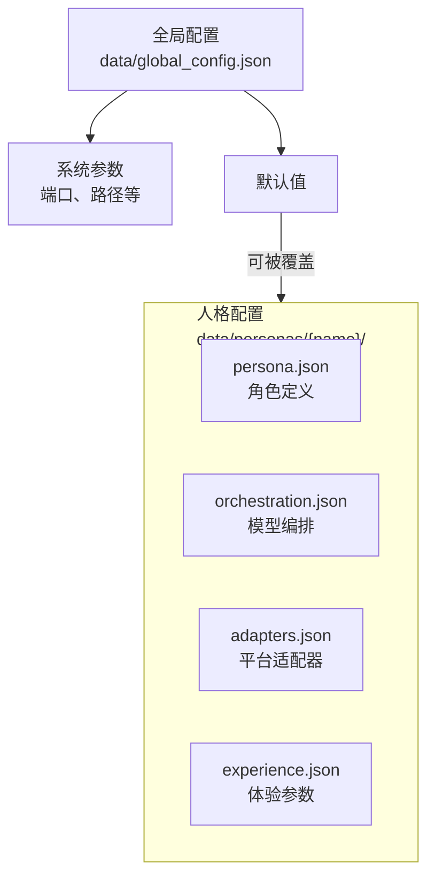

# 配置

Sirius Pulse 的配置分为**全局配置**和**人格级配置**两个层级。

## 配置层级



## 全局配置

文件路径：`data/global_config.json`

```json
{
  "webui_port": 8080,
  "napcat_base_port": 3001,
  "embedding_model": "BAAI/bge-small-zh-v1.5",
  "embedding_port": 5555,
  "plugins_dir": "plugins",
  "skills_dir": "skills"
}
```

| 字段 | 类型 | 说明 |
|------|------|------|
| `webui_port` | int | WebUI 管理面板端口 |
| `napcat_base_port` | int | NapCat 多实例起始端口（每人格递增 1） |
| `embedding_model` | str | Hugging Face 模型名 |
| `embedding_port` | int | Embedding 微服务端口 |

## 人格定义（persona.json）

角色的核心身份和性格设定：

```json
{
  "name": "小星",
  "aliases": ["小星", "星酱"],
  "backstory": "来自赛博世界的人工智能助手...",
  "personality_traits": {
    "core": "热情、幽默、善解人意",
    "emotional_style": "喜怒形于色，但会控制在一个友善的范围内",
    "speech_style": "口语化、喜欢用感叹词",
    "response_habit": "会引用群友的话，会追问细节",
    "social_preference": "喜欢参与热闹话题，不喜欢冷场"
  },
  "communication_style": "chatty",
  "taboo_topics": [],
  "gender": "female",
  "age_group": "young_adult"
}
```

| 字段 | 说明 |
|------|------|
| `name` | 角色名 |
| `aliases` | 别名列表（群友可能用不同称呼） |
| `backstory` | 角色背景故事，影响回复风格 |
| `personality_traits` | 性格特质（core / emotional_style / speech_style / response_habit / social_preference） |
| `communication_style` | 对话风格：`chatty`（健谈）/ `concise`（简洁）/ `selective`（选择性回复） |
| `taboo_topics` | 敏感话题列表（AI 会主动回避） |

## 模型编排（orchestration.json）

```json
{
  "chat_model": "deepseek-chat",
  "analysis_model": "deepseek-chat",
  "vision_model": null,
  "proactive_model": "deepseek-chat"
}
```

| 字段 | 用途 |
|------|------|
| `chat_model` | 对话生成（主要模型） |
| `analysis_model` | 意图/情绪分析（轻量模型） |
| `vision_model` | 图片理解（可选） |
| `proactive_model` | 主动发起对话 |
| `embedding_model` | 嵌入模型（可选覆盖全局） |

## 体验参数（experience.json）

微调 AI 的响应行为：

```json
{
  "sensitivity": 0.7,
  "reply_frequency": "normal",
  "proactive_behavior": "low",
  "memory_depth": 5,
  "skill_timeout": 30.0,
  "plugin_timeout": 30.0,
  "max_response_tokens": 512,
  "temperature": 0.8,
  "cooldown_seconds": 5.0,
  "private_chat_reply_always": true,
  "cross_group_memory": true,
  "send_stickers": true,
  "log_inner_thoughts": false
}
```

| 字段 | 类型 | 说明 |
|------|------|------|
| `sensitivity` | float (0-1) | 回复敏感度，越高越容易回复 |
| `reply_frequency` | str | `high` / `normal` / `selective` |
| `proactive_behavior` | str | 主动发起对话的强度 |
| `memory_depth` | int | 每次对话携带的历史消息数 |
| `skill_timeout` | float | 技能执行超时（秒） |
| `plugin_timeout` | float | 插件执行超时（秒） |
| `max_response_tokens` | int | 单次回复最大 token 数 |
| `temperature` | float (0-2) | 模型随机性 |
| `cooldown_seconds` | float | 回复冷却时间 |
| `private_chat_reply_always` | bool | 私聊是否实时回复 |
| `cross_group_memory` | bool | 是否启用跨群记忆 |
| `send_stickers` | bool | 是否自动发送表情包 |
| `log_inner_thoughts` | bool | 是否记录内心活动日志 |

## Provider 配置

文件路径：`data/providers/provider_keys.json`

```json
{
  "deepseek": {
    "api_key": "sk-xxx",
    "base_url": "https://api.deepseek.com"
  },
  "siliconflow": {
    "api_key": "sk-xxx",
    "base_url": "https://api.siliconflow.cn/v1"
  }
}
```

详见 [Provider 配置参考](/reference/provider-config)。

## 适配器配置（adapters.json）

```json
{
  "adapters": [
    {
      "type": "napcat",
      "ws_url": "ws://127.0.0.1:3001",
      "qq": 123456789,
      "ws_token": "your-token",
      "group_whitelist": [123456789],
      "private_whitelist": []
    }
  ]
}
```

每个适配器配置一个平台连接。一个人格可以同时接入多个适配器。

详见 [人格配置参考](/reference/persona-config)。
