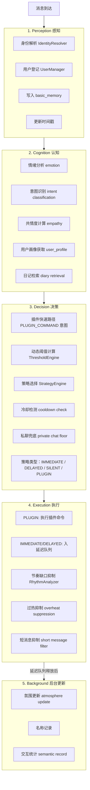

# 引擎架构

EmotionalGroupChatEngine 是 Sirius Pulse 的核心，负责从消息输入到回复输出的完整处理链路。

## 组合模式架构

引擎通过**组合模式**集成多个组件，所有组件通过 `engine._xxx` 属性访问：

```python
class EmotionalGroupChatEngine(_EmotionalGroupChatEngineBase):
    """组合模式最终类，所有组件已集成到基类中。"""
    pass

# 组件访问示例
engine._pipeline      # Pipeline: 5 阶段管线
engine._bg_tasks_mgr  # BackgroundTasks: 后台任务管理
engine._helpers       # Helpers: 技能集成、工具方法
engine._persistence   # EnginePersistence: 状态持久化
engine._sticker       # EngineSticker: 表情包系统
```

## 5 阶段管线

每条消息经过完整的 5 阶段处理：



## 核心子系统

### 认知分析器（CognitionAnalyzer）

联合分析情绪和意图。输入最近 N 条历史消息 + 当前消息，输出 `IntentAnalysisV3` + `EmotionState`。

认知分析器集成了传记系统的用户别名数据，当群聊中存在用户别称映射时（如 `"小明" → 张三`），会将这些信息注入 LLM prompt，帮助模型区分 AI 自身的别名和其他用户的别称，从而更准确地计算 `directed_score`（消息指向 AI 的程度）。

### 阈值引擎（ThresholdEngine）

动态计算回复阈值，考虑因素：

- 灵敏度设置（sensitivity）
- 群聊热度（heat）
- 消息速率（message_rate）
- 用户互动率（engagement_rate）
- 传记亲和力（biography affinity）
- 人格回复频率偏置

### 策略引擎（ResponseStrategyEngine）

根据阈值和意图选择策略：
- **IMMEDIATE**: 直接回复
- **DELAYED**: 延迟回复（等待确认窗口）
- **SILENT**: 不回复
- **PLUGIN**: 执行插件命令

### 节奏分析器（RhythmAnalyzer）

监控群聊节奏，检测：
- **加速中**（accelerating）：活跃讨论
- **平稳**（steady）：正常节奏
- **减速中**（decelerating）：话题冷却
- **沉默**（silent）：无人发言

### 延迟响应队列（DelayedResponseQueue）

非立即回复进入延迟队列，在确认窗口后释放。支持队列合并（连续发送多条消息时合并为一条回复）。

## Brain 系统

Brain 是引擎的 LLM 调用层，支持：

- **任务路由**: 根据 task_name（response_generate, cognition_analyze, proactive_generate）选择合适的模型
- **Post-Hooks 链**: 回复生成后的后置处理，按优先级执行：

| 优先级 | Hook | 功能 |
|--------|------|------|
| 0 | `_hook_depth` | 对话深度追踪 |
| 20 | `_hook_stickers` | 表情包发送 |
| 30 | `_hook_dedup` | 回复去重 |
| 40 | `_hook_memory` | 记忆记录（basic + semantic） |
| 50 | `_hook_timestamp` | 回复时间戳 + 持久化 |

## 后台任务

引擎运行 6 个后台异步任务：

| 任务 | 间隔 | 功能 |
|------|------|------|
| 延迟响应轮询 | 1s | 释放到期延迟回复 |
| 主动行为评估 | 可变 | 评估是否需要主动发起对话 |
| 日记归档 | 可变 | 群聊沉寂后归档对话 |
| 记忆维护 | 可变 | 语义记忆整理和衰减 |
| 状态持久化 | 300s | 全量保存运行时状态 |
| 提醒检查 | 10s | 到期提醒分发（来自 reminder skill） |

## 记忆持久化

引擎在以下时机进行持久化：
- 每次回复后（单群状态）
- 定期全量保存（300 秒间隔）
- 引擎停止时

持久化内容包括：basic_memory、时间戳、emotion、delay_queue、token_usage、diary、proactive_state。

详见 [记忆系统](./memory-system)。
