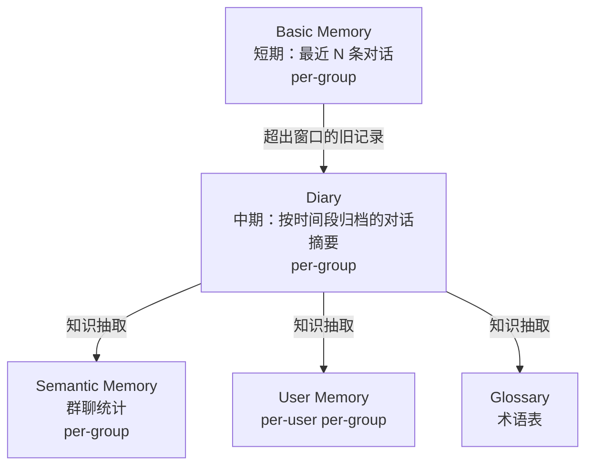
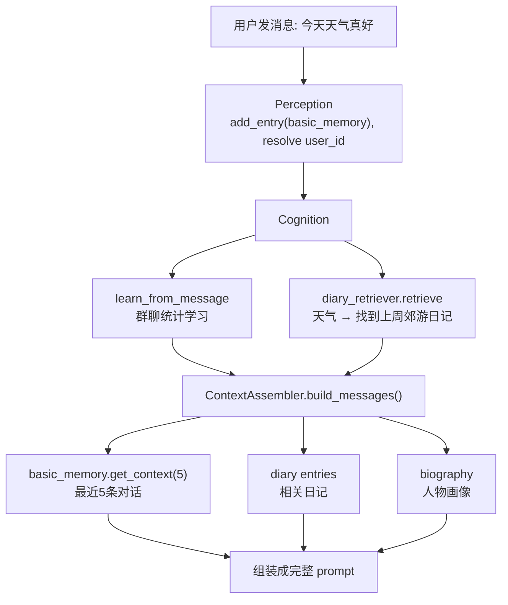

# 记忆系统

Sirius Pulse 采用分层记忆架构，从短期的工作记忆到长期的语义理解，逐层抽象。

## 架构总览



## 基础记忆（Basic Memory）

**最底层的短期记忆**，每群独立维护一个固定大小的双端队列。

```python
# 内部结构
per-group deque:
  [entry_1, entry_2, ..., entry_N]  # N = hard_limit (默认 30)
```

### 条目结构

每个 `BasicMemoryEntry` 包含以下字段：

| 字段 | 说明 |
|------|------|
| `role` | 角色：`user` / `assistant` |
| `user_id` | 用户 ID（机器人回复为 `"assistant"`） |
| `timestamp` | 消息时间戳（浮动秒数） |
| `content` | 消息文本内容 |
| `speaker_name` | 显示名（用户昵称或机器人名称） |
| `channel_type` | 平台类型（如 `qq`） |
| `channel_user_id` | 平台原始 ID（如 QQ 号） |
| `multimodal_inputs` | 多模态输入列表（如图片） |
| `tags` | 内容标签（表情包、钉住等） |
| `conversation_chain` | **完整 LLM 消息链**（详见下文） |

`conversation_chain` 字段用于记录 AI 回复生成时所使用的完整消息列表，包含 `system` prompt 及后续 `user` / `assistant` 交替消息，便于对话历史页面还原 LLM 调用上下文。

### 核心参数

| 参数 | 默认值 | 说明 |
|------|--------|------|
| `hard_limit` | 30 | 每群最大保留条目数 |
| `context_window` | 5 | 活跃上下文窗口（最近 5 条用于 LLM prompt） |

### 操作

- `add_entry()`: 添加对话记录到队列尾部，先进先出。可传入 `conversation_chain` 参数记录完整消息链。
- `get_context(n)`: 获取最近 n 条上下文（用于 prompt 构建）
- `get_archive_candidates()`: 获取超出 context_window 的旧条目（用于日记归档）
- `get_entries_by_user()`: 跨群查询某用户发言

### 热度计算

`HeatCalculator` 综合三个维度计算群聊热度：

- **消息速率** (40%): 最近 N 秒内的消息密度
- **发言人数** (30%): 有多少不同用户参与
- **最近性** (30%): 距离最后一条消息的时间

### 冷检测（ColdDetector）

`ColdDetector` 根据群聊热度和距离最后一条消息的时间判断冷状态，替代了旧版 `is_cold` 的简单二元判断。

| 状态 | 含义 | 触发条件（示例） |
|------|------|------------------|
| `HOT` | 活跃 | 热度高于阈值且间隔短 |
| `COOLING` | 暂冷 | 热度下降，间隔适中 |
| `COLD` | 深冷 | 长时间无消息 |

后台任务 `_background_refiner` 会根据冷状态分层处理：
- `COOLING` → 情景提取（Situation Extraction）：对近期对话进行结构化摘要
- `COLD` → 优先从 `situation_store` 获取未处理的已提取情景（Situation），若有则基于这些情景生成日记并切分为切片，之后标记情景为已处理；若无情景则尝试从 basic_memory 的候选消息中补提情景（补提后再次获取情景），补提仍无结果时回退到旧逻辑：将旧消息归档为日记，同时通过 LLM 提取三元组存入演化链。

## 日记系统（Diary）

当群聊进入 `COLD` 状态时，系统优先使用该群已经提取的情景（Situation）来生成结构化日记。若没有已提取的情景，则尝试从 basic_memory 中超出窗口的旧消息中补提情景，补提成功后生成日记。若仍无法获取情景，则直接归档旧消息为日记。冷状态由 `ColdDetector` 根据热度与沉寂时长综合判定。

### 组件

| 组件 | 功能 |
|------|------|
| `DiaryGenerator` | 将对话片段生成为结构化日记条目（使用 LLM） |
| `DiaryStore` | 日记持久化存储 |
| `DiaryVectorStore` | 日记向量索引（ChromaDB） |
| `DiaryRetriever` | 语义检索相关日记 |
| `DiaryConsolidator` | 合并多条日记为更高层的摘要 |
| `DiarySliceStore` | 日记切片的文件持久化存储（JSON 文件，按群组索引），支持按 ID 批量删除（`delete_by_ids`） |
| `DiarySliceVectorStore` | 日记切片向量的 ChromaDB 持久化索引 |
| `DiarySliceRetriever` | 日记切片的三路召回检索：语义（ChromaDB）+ 三元组精确匹配 + 关键词降级 |

### 日记切片

当日记归档后，系统自动对生成的日记条目进行切片（`DiarySlicer`），生成一系列结构化片段（`DiarySlice`），每片包含摘要、关键词、时间范围、参与实体、关联情景 ID 及嵌入向量。

- **持久化**：切片通过 `DiarySliceStore` 存储为 JSON 文件，路径为 `{work_path}/diary/slices/{group_id}.json`；同时向量通过 `DiarySliceVectorStore`（基于 ChromaDB）持久化。
- **三路召回**：`DiarySliceRetriever` 在检索时融合三条路径：
  1. 语义检索：`DiarySliceVectorStore` 计算查询嵌入与切片嵌入的余弦相似度
  2. 三元组精确匹配：查询实体命中切片 `triple_subjects` 字段
  3. 关键词降级：字符重叠率匹配
- **历史加载**：引擎启动时，`slice_store.load_all()` 加载所有历史切片并注入检索器索引，保证跨会话持续可用。

### 日记条目结构

```json
{
  "date": "2026-05-22",
  "summary": "今天群友们讨论了关于新游戏的发布...",
  "topics": ["游戏", "Steam"],
  "participants": ["user_a", "user_b"],
  "mood": "兴奋",
  "events": ["张三分享了一个游戏链接"]
}
```

### 日记切片结构（DiarySlice）

`DiarySlice` 包含以下字段（新增 `situation_ids` 用于关联生成该切片的情景记录）：

| 字段 | 类型 | 说明 |
|------|------|------|
| `slice_id` | `str` | 切片唯一标识 |
| `summary` | `str` | 切片摘要 |
| `keywords` | `list[str]` | 关键词 |
| `triple_subjects` | `list[str]` | 三元组主语列表（用于精确匹配） |
| `triple_predicates` | `list[str]` | 三元组谓语列表 |
| `source_record_ids` | `list[str]` | 来源日记记录 ID |
| `situation_ids` | `list[str]` | 关联的情景 ID 列表（由生成该切片的情景提取而来） |
| `participants` | `list[str]` | 参与者用户 ID |
| `time_range_start` | `str` | 时间范围起点 |
| `time_range_end` | `str` | 时间范围终点 |
| `embedding` | `list[float]` | 向量嵌入 |

### ContextAssembler 的日记集成

`ContextAssembler.build_messages()` 在构建 prompt 时会：

1. 使用当前消息作为查询检索相关日记（`diary_top_k` 条）
2. 将日记内容注入 system prompt 的背景信息区域
3. 支持 token 预算控制（`diary_token_budget`）

## 语义记忆（Semantic Memory）

...（原语义记忆内容不变）

## 演化链（Evolution Chain）

演化链是长期事实记忆的演进系统，以三元组（subject-predicate-obj）形式存储知识，并支持置信度更新、来源溯源与元标签标记。

### 设计目标

- **可演化**：事实可随新证据自动修正或淘汰
- **可追溯**：每条记录携带来源信息（消息ID、提取模型）
- **可评估**：置信度反映事实的可信度，支持时间衰减

### 存储结构

每条 `EvolutionRecord` 包含：

| 字段 | 说明 |
|------|------|
| `subject` / `predicate` / `obj` | 三元组主语、谓语、宾语 |
| `subject_user_id` | 主语对应的用户ID（如有） |
| `status` | 状态：`ACTIVE`、`SUPERSEDED`、`CONFLICTING` |
| `confidence` | 当前置信度（0.0~1.0） |
| `initial_confidence` | 初始置信度 |
| `source_type` | 来源类型：`MetaTag.INFERENCE`（LLM 提取）、`MIGRATION`（数据迁移）、`DIRECT`（直接记录） |
| `source_group_id` / `source_message_ids` | 来源群组与消息 |
| `extracted_by_model` | 提取模型标识 |

### 别称管理

演化链承担了别名管理的核心职责，替代了原先 `UnifiedUserManager` 中的 `_alias_index`。系统通过 `EvolutionChain` 的 `register_alias` 和 `resolve_alias` 方法处理所有别名的注册与解析。

- **别称注册**：`register_alias(alias, user_id, user_name, group_id, source)` 创建或增强一条谓语为 `"别名"`（常量 `ALIAS_PREDICATE`）的演化记录。首次注册时，napcat 来源的置信度为 0.50，LLM 发现的置信度为 0.30；后续每次提及都会通过 `add_verification` 增强置信度（+0.05）。
- **别称解析**：`resolve_alias(alias, group_id, recent_speakers, at_user_id)` 根据缓存（`_alias_cache`）查找匹配的活跃记录，支持消歧策略：@ 锚定 > 最近活跃 > 置信度领先（1.5x 阈值）。返回 `(user_id, confidence, 候选列表)`。
- **用户别称查询**：`get_user_aliases(user_id)` 从缓存中收集某用户的所有别称。
- **缓存维护**：`_alias_cache` 为 `dict[str, list[EvolutionRecord]]`，仅包含 `ACTIVE` 状态的别称记录，启动时从持久化存储加载。

### 学习机制

- **情景提取（Situation Extraction）**：在群聊暂冷（`COOLING`）时，`SituationExtractor` 对近期对话进行结构化提取，生成三元组存入演化链；当群聊深冷（`COLD`）且无已提取情景时，也会尝试补提情景。`extract` 方法新增 `storage` 参数，用于获取群组的别名映射，提升实体识别的准确率
- **日记知识抽取**：日记归档时，LLM 提取长期观点、关系等事实写入演化链
- **数据迁移**：旧版 `UnifiedUser` 的 `distilled_points`、`identity_anchors`、`relationships` 通过 `migrate_to_evolution.py` 脚本批量迁移至演化链，标记为 `MetaTag.MIGRATION`，置信度设为 0.5

### 用户画像的演进

`UnifiedUserManager` 不再直接从对话中更新传记，而是依赖演化链中的事实记录进行整合。演化链与传记模型通过以下流程协同：

1. 新事实写入演化链（情景提取 / 日记 / 交互处理）
2. `UnifiedUserManager` 从演化链中查询与用户相关的高置信度记录
3. 定期调用 LLM 综合演化链事实重写 `short_bio`、`identity_anchors`、`relationships`

基于群聊统计的长期记忆系统，追踪群聊的氛围规范与用户交互行为（不依赖向量检索）。

### 存储层级

| 层级 | 范围 | 说明 |
|------|------|------|
| `group` | 单个群聊 | 群氛围、规范、活跃时段、平均消息长度、表情/提及率、兴趣话题、禁忌话题、主导话题 |
| `user` | 单个用户在某群 | 互动率（engagement_rate）、交互次数、熟悉度、反馈追踪 |

群聊画像数据存储在 `group_semantic_profiles` 表中，除上述信息外还包括 `group_name`、`interest_topics`（兴趣话题）、`group_norms`（群规范详情）、`taboo_topics`（禁忌话题）、`dominant_topic`（主导话题）等字段。

此外，系统会持续追踪群聊的动态氛围和历史交互反馈，存储在以下两张表中：

- **`atmosphere_history`**：记录群聊氛围的时间序列，包含 `group_valence`（情绪效价）、`group_arousal`（唤醒度）、`active_participants`（活跃参与者数）等指标。
- **`group_pending_ai_responses`**：记录 AI 发送给群聊的消息及其后续用户互动情况，用于评估响应效果和学习互动模式。包含 `sent_at`、`target_user_id`、`topic_hint`、`response_length`、`was_engaged`、`engagement_latency_s` 等字段。

这些数据为认知引擎的决策提供依据，例如根据氛围历史调整响应策略，或者根据用户对 AI 消息的回应情况动态调整参与度。

### 学习机制

引擎在认知阶段会调用 `semantic_memory.learn_from_message()` 自动学习群聊特征：
- 消息长度分布（short / medium / long）
- 表情使用率和提及率
- 活跃时段分布
- 社交意图频率分布

### 用户交互追踪

通过 `record_user_interaction()` 实时追踪每个用户的交互模式：
- **engagement_rate**：基于 EMA（指数移动平均）计算的互动响应率
- **interaction_count**：精确交互计数器
- **familiarity**：基于对数曲线的熟悉度（`log1p(n) / log1p(50)`）
- **pending_responses**：消息级反馈队列（用于检测用户是否响应了 AI 的发言）

### 记忆记录

回复生成后，`_hook_memory` 会写入 basic_memory 和 semantic_memory：
- 自己的回复 → 记录群聊互动状态
- 用户的消息 → 更新用户交互统计

## 统一用户模型（UnifiedUser）

统一用户模型整合了原来的用户管理（`UserManager`）和人物传记（`BiographyManager`），通过 `UnifiedUserManager` 统一管理每个用户（跨群）的认知信息。

### 核心模型 `UnifiedUser`

每个用户对应一个 `UnifiedUser` 实例（通过 `user_id` 标识），包含以下字段：

| 字段 | 说明 |
|------|------|
| `name` | 用户显示名（可跨群更新） |
| `aliases` | 跨群收敛的别名列表（`AliasEntry`，含置信度、来源） |
| `short_bio` | 浓缩传记全文（不超过 500 字），描述用户身份、性格、偏好、习惯 |
| `identity_anchors` | 身份锚点（最多 5 条，每条不超过 20 字） |
| `relationships` | 该用户与其他人的关系网络（`RelationshipAnchor`，含 target_user_id、关系类型、事实描述、提及次数、时间戳） |
| `affinity_score` | 用户对 AI 的亲和力分数（-1.0=敌对, 0.0=中立, 1.0=友好），由 LLM 逐层更新时输出，经 EMA 平滑 |
| `metadata` | 附加元数据（如开发者标记 `is_developer`） |

### 别名管理

别名管理已从 `UnifiedUserManager` 的 `_alias_index` 迁移至演化链（`EvolutionChain`）。`UnifiedUserManager` 通过其持有的 `_evolution_chain` 实例委托所有别名操作：

- **注册**：`register_alias()` 内部调用 `evolution_chain.register_alias()`，创建或增强别称演化记录（谓语为 `"别名"`）。
- **解析**：`resolve_alias()` 内部调用 `evolution_chain.resolve_alias()`，利用别称缓存进行消歧。
- **查询**：`get_user_aliases()` 从演化链缓存中收集某用户的所有别称。
- **别名置信度**：napcat 来源初始 0.50，LLM 发现初始 0.30，后续每提及一次增强 0.05。
- **时间衰减**：演化链通用置信度衰减机制（每日 5%）同样作用于别称记录，低于 0.10 自动标记为 `SUPERSEDED`。
- 别称数据通过 `evolution_chain.get_user_aliases(user_id)` 和 `evolution_chain._alias_cache` 暴露给认知分析器。

### 亲和力反馈回路

`affinity_score` 反馈到引擎决策阶段：

- `affinity > 0.3`（友好）→ 响应阈值降低，最多降至 0.75x
- `affinity < -0.3`（不友好）→ 响应阈值提高，最多升至 1.40x
- LLM 未更新过信息（`affinity_score` 为默认值）的用户不触发调节

### 信息注入

用户信息通过 `PromptFactory.build_biography_section()` 格式化为 `【人物速查】` 段落，注入到 system prompt 中供 LLM 参考。

### 蒸馏与更新（两层凝练）

`UnifiedUserManager` 继承原 `BiographyManager` 的两层凝练架构：
1. **层1 蒸馏（distill）**：攒够 5 条消息或 8 小时后，LLM 从原始对话中提炼关于该用户的关键要点和别名
2. **层2 传记更新（update）**：攒够 3 个蒸馏要点或 24 小时后，LLM 综合旧传记和新要点，重写完整的用户档案（`short_bio`、`identity_anchors`、`relationships`、`affinity_score`）

## 术语表（Glossary）

`GlossaryManager` 管理自定义术语/黑话解释。`learn_term` 技能可以动态添加术语。

## 消息钉住（Pinned Messages）

消息钉住功能允许 AI 在对话上下文中保留重要信息，即使这些信息超出短期记忆窗口。钉住的消息会随每次 prompt 注入到上下文中，直到达到携带次数上限或时间过期。

### 核心参数

| 参数 | 默认值 | 说明 |
|------|--------|------|
| `MAX_PINNED_MESSAGES` | 10 | 全局最大可钉住消息数量 |
| `PINNED_MESSAGE_MAX_AGE_HOURS` | 24 | 钉住消息最大保留时间（小时） |
| `PINNED_MESSAGE_MAX_CARRY_COUNT` | 100 | 钉住消息最大携带次数（每次 prompt 注入计数+1，超过后自动取消） |

### 消息钉住管理器

`PinnedMessageManager` 负责管理钉住消息的生命周期，支持以下操作：

- `pin_message()`: 钉住一条消息，可指定内容、发言人、群组、原因、TTL、最大携带次数
- `unpin_message()`: 根据消息 ID 取消钉住
- `unpin_by_reason()`: 根据原因取消钉住（如“钉住此规则”）
- `unpin_by_content()`: 根据内容关键词取消钉住
- `unpin_all()`: 取消指定群组的所有钉住
- `get_pinned_messages_for_prompt()`: 获取钉住消息并增加携带计数，用于 prompt 注入

### 钉住/取消钉住指令

AI 在回复中使用特殊语法来钉住或取消钉住消息：

- 钉住：`<pin reason="原因">需要保留的内容</pin>`
- 取消钉住：`<unpin reason="原因"/>` 或 `<unpin all/>`

系统会自动解析这些指令并执行对应的钉住/取消钉住操作。

### 信息注入

钉住消息会在构建 prompt 时被注入到 system prompt 中，格式为：

```
【钉住消息】
- 内容...
```

`ContextAssembler` 在 `build_messages()` 中会调用 `pinned_messages_fn` 获取当前群组的有效钉住消息，并将其添加到系统提示中。

### 携带计数与自动过期

每条钉住消息记录 `carry_count`，每次被用于 prompt 注入时加 1。当 `carry_count` 超过 `MAX_CARRY_COUNT` 时，消息自动取消钉住。同时，超过 `MAX_AGE_HOURS` 的消息也会被清理。

## 配置调优

在 `experience.json` 中控制记忆行为：

```json
{
  "memory_depth": 5,
  "cross_group_memory": true,
  "pinned_message_max_carry_count": 100
}
```

- `memory_depth`: 每次加载的历史消息数
- `cross_group_memory`: 是否启用跨群记忆
- `pinned_message_max_carry_count`: 钉住消息的最大携带次数，超过后自动取消

## 数据流示例



### 插件命令快速拦截

在处理流程中，插件命令（如 `/ca analyse`）会在认知阶段之前被快速拦截，避免被 LLM 当作自然语言处理，无需 LLM 调用即可执行，降低延迟。

详见 [引擎架构](./engine-architecture) 了解记忆在管线中的位置。
