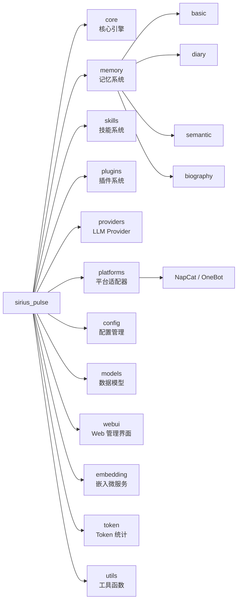

# 开发指南

Sirius Pulse 的开发环境搭建、代码规范与贡献流程。

## 开发环境

### 安装

```bash
git clone https://github.com/Sparrived/SiriusChat.git
cd SiriusChat
pip install -e ".[dev,test,provider,quality]"
```

### 可用命令

| 命令 | 说明 |
|------|------|
| `make test` | 运行测试 |
| `make test-cov` | 运行测试 + 覆盖率报告 |
| `make lint` | pylint + flake8 代码检查 |
| `make format` | black + isort 格式化 |
| `make typecheck` | mypy 类型检查 |
| `make build` | 构建分发包 |

### 一键质量检查

```bash
python scripts/ci_check.py
```

## 项目结构



## 代码规范

### 工具配置

| 工具 | 配置 |
|------|------|
| black | `--line-length=100` |
| isort | `--profile=black --line-length=100` |
| flake8 | `--max-line-length=100 --extend-ignore=E203,W503` |
| pylint | `--fail-under=7.5` |
| mypy | `--ignore-missing-imports` |

### 强制约定

1. 每模块首行必须写：`from __future__ import annotations`
2. 严格定义 `__all__`
3. 模块级 logger：
   ```python
   logger = logging.getLogger(__name__)
   ```
4. 核心数据契约使用 `@dataclass`
5. 配置持久化使用临时文件 + `replace` 原子写入

## 测试指南

### 编写测试

测试文件放在 `tests/` 目录下，命名规范：`test_{module_name}.py`

```python
import pytest

def test_basic_memory_add():
    from sirius_pulse.memory.basic import BasicMemoryManager
    mgr = BasicMemoryManager()
    mgr.add_entry("g1", "u1", "user", "hello")
    ctx = mgr.get_context("g1")
    assert len(ctx) == 1
    assert ctx[0].content == "hello"
```

### 使用 Mock

```python
from sirius_pulse.providers.mock import MockProvider

mock = MockProvider(responses={"hi": "hello!"})
```

### 运行限制

- 测试总时间 < 15 秒
- 避免真实网络请求
- 使用 `tmp_path` fixture 管理临时文件

## 贡献流程

1. Fork 仓库
2. 创建特性分支：`git checkout -b feat/my-feature`
3. 开发并编写测试
4. 运行完整检查：`python scripts/ci_check.py`
5. 提交：使用 [Conventional Commits](https://www.conventionalcommits.org/) 格式
6. 发起 PR 到 `main` 分支

## Commit 规范

```
feat: 添加天气查询插件支持
fix: 修复记忆持久化时的竞态条件
docs: 更新技能开发文档
refactor: 重构插件注册表索引结构
test: 补充技能执行器单元测试
```

## CI/CD

GitHub Actions 在每次 PR 时自动执行：
1. **test**: pytest + 覆盖率
2. **lint**: 代码质量检查
3. **security**: bandit 安全扫描
4. **build**: 构建分发包

版本标签推送 (`v*`) 会触发 PyPI 自动发布。

## 架构参考

详细架构信息见：
- [引擎架构](/guide/engine-architecture)
- [记忆系统](/guide/memory-system)
- [技能系统总览](/extensions/skill-overview)
- [插件系统总览](/extensions/plugin-overview)
